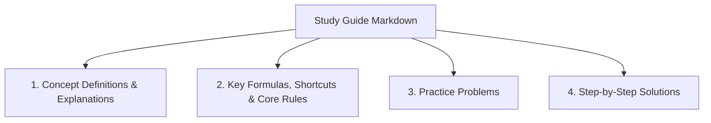

# Aptitude & Reasoning Prep Kit

A comprehensive, structured study resource and practice suite for **Quantitative Aptitude**, **Logical Reasoning**, **Data Interpretation**, and **Verbal Ability**. This repository serves as a self-paced learning portal containing core concepts, math/grammar formulas, practice problems, and detailed step-by-step solutions for competitive examination preparation.

---

## 🗺️ Learning Path & Modules

The study materials are organized into four core subjects. Each topic contains structured study notes, cheat sheets, and practice questions.

| Module | Topics Included | Quick Links |
| :--- | :--- | :--- |
| **Quantitative Aptitude** | Core Arithmetic, Algebra, Geometry, and Modern Math | 📈 [Go to Quant](#-quantitative-aptitude) |
| **Logical Reasoning** | Analytical & Non-Verbal Reasoning, Sequences, Puzzles | 🧠 [Go to Reasoning](#-logical-reasoning) |
| **Data Interpretation** | Graphical Analysis, Tables, and Data Analysis | 📊 [Go to DI](#-data-interpretation) |
| **Verbal Ability** | English Grammar, Reading Comprehension, Vocabulary | ✍️ [Go to Verbal](#%EF%B8%8F-verbal-ability) |

---

## 📈 Quantitative Aptitude

This module covers mathematical concepts, derivations, speed-math shortcuts, and problem-solving techniques.

| Topic | Description | Link |
| :--- | :--- | :--- |
| **Number System** | Number classifications, cyclicity, remainders, and factors. | [View Note](./Number_System.md) |
| **HCF & LCM** | Divisibility rules, highest common factors, and lowest common multiples. | [View Note](./HCF_LCM_Divisibility.md) |
| **Simplification** | BODMAS rule, algebraic identities, surds, and indices. | [View Note](./Simplification.md) |
| **Averages & Mixtures** | Arithmetic mean, weighted averages, alligation rules. | [View Note](./Averages_Mixtures.md) |
| **Percentages** | Fractional equivalents, percentage increase/decrease, successive changes. | [View Note](./Percentages.md) |
| **Ratio & Proportion** | Ratios, direct/inverse proportions, partnerships. | [View Note](./Ratio_Proportion.md) |
| **Profit, Loss & Discount** | Cost, selling, and marked prices, successive discounts, dishonest dealer cases. | [View Note](./Profit_Loss_Discount.md) |
| **Simple & Compound Interest** | Simple interest, compounding periods, CI/SI difference formulas. | [View Note](./Simple_Compound_Interest.md) |
| **Time & Work** | Work equivalence, efficiency, pipes and cisterns. | [View Note](./Time_Work.md) |
| **Speed, Time & Distance** | Relative speed, average speed, trains, boats, and streams. | [View Note](./Speed_Time_Distance.md) |
| **Problems on Ages** | Algebraic equations involving past, present, and future ages. | [View Note](./Problems_on_Ages.md) |
| **Progressions** | Arithmetic (AP), Geometric (GP), and Harmonic (HP) progressions. | [View Note](./Progressions.md) |
| **Permutations & Combinations** | Fundamental counting principles, arrangements, and selections. | [View Note](./Permutations_Combinations.md) |
| **Probability** | Basic outcomes, conditional probability, independent events, and cards/dice/coins. | [View Note](./Probability.md) |
| **Mensuration** | 2D and 3D area, perimeter, volume, and surface area formulas. | [View Note](./Mensuration.md) |

---

## 🧠 Logical Reasoning

This module strengthens analytical skills, critical thinking, deduction, and pattern recognition.

| Topic | Description | Link |
| :--- | :--- | :--- |
| **Blood Relations** | Family tree puzzles, coded relationships, and symbols. | [View Note](./Blood_Relations.md) |
| **Direction Sense** | Cardinal directions, angle turns, and shortest distance (Pythagoras theorem). | [View Note](./Direction_Sense.md) |
| **Coding & Decoding** | Letter-to-letter, letter-to-number, and substitution coding. | [View Note](./Coding_Decoding.md) |
| **Order & Ranking** | Position determination, rank comparison, and queue ordering. | [View Note](./Order_Ranking.md) |
| **Seating Arrangement** | Linear, circular, and polygonal arrangement layouts. | [View Note](./Seating_Arrangement.md) |
| **Puzzles & Scheduling** | Multi-variable puzzles, floor-based, and day/month scheduling. | [View Note](./Puzzles_Scheduling.md) |
| **Syllogism** | Venn diagram analysis, statements, and logical deductions. | [View Note](./Syllogism.md) |
| **Input & Output** | Step-by-step alphanumeric sequence sorting and rearrangement patterns. | [View Note](./Input_Output.md) |

---

## 📊 Data Interpretation

This module tests quantitative reasoning and analysis using data represented in various formats.

| Topic | Description | Link |
| :--- | :--- | :--- |
| **Tables & Caselets** | Tabular raw data and descriptive passage-based numerical data. | [View Note](./Tables_Caselets.md) |
| **Bar & Line Graphs** | Single/multiple bar charts and line-based trend graphs. | [View Note](./Bar_Line_Graphs.md) |
| **Pie Charts** | Degree and percentage-based distribution charts. | [View Note](./Pie_Charts.md) |
| **Data Sufficiency** | Assessing if the given statements are sufficient to answer a problem. | [View Note](./Data_Sufficiency.md) |

---

## ✍️ Verbal Ability

This module covers English language proficiency, grammar correctness, comprehension, and vocabulary.

| Topic | Description | Link |
| :--- | :--- | :--- |
| **Grammar & Error Spotting** | Subject-verb agreement, tenses, article usage, and prepositions. | [View Note](./Grammar_Error_Spotting.md) |
| **Sentence Completion** | Fill in the blanks with appropriate words or phrases. | [View Note](./Sentence_Completion.md) |
| **Para Jumbles** | Unscrambling sentences to form coherent paragraphs. | [View Note](./Para_Jumbles.md) |
| **Reading Comprehension** | Passage reading, central theme identification, tone, and inference questions. | [View Note](./Reading_Comprehension.md) |
| **Idioms & Phrases** | Meanings and usage of common figurative expressions. | [View Note](./Idioms_Phrases.md) |
| **Vocabulary** | Synonym, antonym, and contextual word meanings. | [View Note](./Vocabulary.md) |

---

## 📝 Document Anatomy

Every study guide in this repository is designed with a consistent, learner-friendly structure:

1. **Concept Definitions & Explanations**: Fundamental, clear breakdowns of core terminology and behaviors.
2. **Key Formulas / Shortcuts / Core Rules**: High-yield formulas formatted in standard LaTeX ($LaTeX$) alongside quick-computation tricks or grammar guidelines.
3. **Practice Problems**: Standard examination-style questions of varying difficulty levels.
4. **Step-by-Step Solutions**: Explanatory walkthroughs of the solution logic, demonstrating how rules and formulas are applied.

---

## 🚀 How to Use These Resources

1. **Review Concepts & Formulas First**: Start with the first two sections of each module file to solidify your foundations. Keep formula files open for quick reference.
2. **Attempt Practice Problems Independently**: Try to solve the questions in the **Practice Problems** section without looking at the solutions.
3. **Analyze Step-by-Step Explanations**: Verify your answers and methodology against the **Step-by-Step Solutions** to learn alternative or faster approaches.
4. **Offline Friendly**: These notes are written in Markdown and use standard LaTeX mathematical syntax, making them readable directly in standard code editors (VS Code, Obsidian, etc.) or when converted to PDF.
